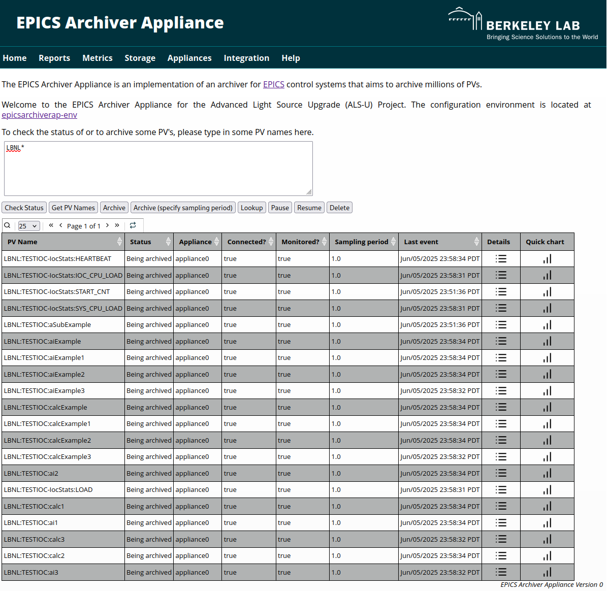

# EPICS Archiver Appliance Configuration Environment with MAVEN
This repository provides the Configuration Environment for the [EPICS Archiver Appliance with MAVEN](https://github.com/jeonghanlee/epicsarchiverap-maven) project, specifically tailored for [the Advanced Light Source Upgrade (ALS-U) Project](https://als.lbl.gov/als-u/overview/) at [Lawrence Berkeley National Laboratory](https://lbl.gov).

The source code for the [EPICS Archiver Appliance with MAVEN](https://github.com/jeonghanlee/epicsarchiverap-maven) build **IS** fundamentally based on the community version. However, its building method **IS NOT** the same as the community version. While the goal is to maintain minimal code differences from the community release, some variations may be present. The primary distinction is the use of **MAVEN** as the core build environment for that project, though **ANT** is also currently utilized for certain auxiliary tasks. For a more detailed understanding of the build system and specific modifications in that version, please refer to the [EPICS Archiver Appliance with MAVEN](https://github.com/jeonghanlee/epicsarchiverap-maven) repository.

**Project Status**: Confirmed that the current version can archive a few PV signals. However, it requires more fine-tuning for maximizing the archiver appliance performance.

## Purpose of this Environment
This repository provides a set of `Makefiles` and scripts to automate the setup and build process for the EPICS Archiver Appliance with MAVEN. It handles system dependencies, database configuration, and service management to create a reproducible environment currently on Debian 12.

## Prerequisites
* **JDK 21+**: Java Development Kit version 21 or newer is required.
* **Apache Maven**: A recent version (e.g., 3.9.x).
    * For easy Java/Maven setup, see [jeonghanlee/java-env](https://github.com/jeonghanlee/java-env).
* **Git**: Required for generating release notes from commit history (this is part of the documentation generation process).
* **Operating System**:
    * Core build (JARs/WARs) is generally OS-agnostic.
    * Sphinx documentation (`build_docs.sh`) is primarily for Linux.
* **Sphinx Tools**: If building Sphinx documentation (which is enabled by default), ensure Sphinx, Python, and any necessary themes/extensions are installed and configured.

## Automated Installation : `install_aa.sh`

`install_aa.sh` performs the whole manual procedure documented below (and in `docs/README.rocky8.md`) automatically, on both the **Debian** (Debian 11/12/13, Ubuntu) and the **Rocky / RHEL** (Rocky, AlmaLinux, RHEL, CentOS Stream 8/9/10) families. The script only generates the `configure/*.local` files and drives the existing `make` rules, so nothing is hidden from the usual workflow.

```bash
# Full installation with the repository defaults
./install_aa.sh

# See what would be done, without touching the system
./install_aa.sh --dry-run

# Unattended installation, own storage location and DB password
./install_aa.sh -y --storage=/home/archappl --db-pass='S3cret!'

# Where is everything, what is installed, is it running ?
./install_aa.sh paths
./install_aa.sh exist
./install_aa.sh status

# Only rebuild and redeploy
./install_aa.sh build install service

# Remove the appliance and its systemd unit
./install_aa.sh uninstall

# Every example, grouped by purpose
./install_aa.sh --help
```

The installation is split into stages, which can also be run one by one:

| Stage | make rules behind it |
| :--- | :--- |
| `pkgs`    | the package list of `scripts/required_pkgs.sh`, per distribution |
| `java`    | JDK 21+ (distribution package or Eclipse Temurin tarball) and Apache Maven, then `configure/*.local` |
| `src`     | `init` (clone and `pom`) |
| `db`      | `db.conf`, `db.secure`, `db.addAdmin`, `db.create`, `sql.fill` |
| `tomcat`  | `tomcat.get`, `tomcat.install` |
| `build`   | `build` (or `conf` + `build.mvn2` with `--skip-docs`) |
| `install` | `install` (services, systemd unit, `sd_enable`) |
| `service` | `systemctl restart $(SYSTEMD_FILENAME)` |
| `verify`  | waits for `http://localhost:17665/mgmt/ui/index.html`, then prints a summary |

Three more stages are never part of a default run and need no `sudo` at all : `paths` (every path and setting in use), `exist` (what is installed and what is still missing, with the command which fixes it) and `status` (systemd and appliance service status). `uninstall` removes the appliance and its systemd unit.

The stage order matters : `src` comes before `db` because `sql.fill` fills the tables from `archappl_mysql.sql`, which lives in the appliance source tree.

Notes

* Run it as a normal user owning `sudo` rights, **not** as `root`, because the make rules call `sudo` themselves.
* The values which are not given on the command line are read back from the current `make` configuration, so a partial run (`./install_aa.sh build`) never resets a previous customization.
* The default storage (`ARCHAPPL_STORAGE_TOP`, `$HOME/arch`) is unusable when the home directory is not readable by the service account (`0700`, the default on Rocky). The script checks this before the build and suggests another location, for example `--storage=/home/archappl`.
* Change the default MariaDB passwords with `--db-pass` and `--db-admin-pass` on a production system.
* On EL systems where the data directory was initialised by the `mysql` system user, `root@localhost` may not exist and every `sudo mysql --user=root` of the `db.*` rules is refused. The `db` stage detects it and recreates `root@localhost` with `unix_socket` authentication through the working socket account.
* Maven downloads a few large artifacts (`jython-standalone` is 47 MB) and some networks reset those transfers. The `build` stage therefore adds `-Dmaven.wagon.http.retryHandler.count=5`; more options can be passed with `--maven-opts=`.
* Run the `make` rules from the repository top, **without** `make -C` : `-C` turns on `--print-directory`, and the sub-make started by `scripts/mariadb_setup.bash` then writes its "Entering directory" lines into the path it captures.
* The whole run is logged into `install_aa.log`.

### `install_full_aa.sh`, the standalone variant

`install_full_aa.sh` is the same installer, but it does not need to be run from inside this repository : it carries every stage itself and fetches the build environment (make rules, `site-template/`, `pom.xml`) at run time. It is meant to be kept in a dedicated installer repository, so a machine can be installed with that single file.

```bash
# One file, a bare machine, nothing else
curl -fsSLO https://raw.githubusercontent.com/<account>/<installer-repo>/main/install_full_aa.sh
bash install_full_aa.sh -y --storage=/home/archappl

# Everything from your own account, pinned
./install_full_aa.sh --env-repo=https://github.com/<account>/epicsarchiverap-env --env-ref=v1.0 \
                     --src-url=https://github.com/<account> --src-tag=v1.0
```

| Option | Meaning |
| :--- | :--- |
| `--env-repo=URL` | build environment repository (default : `https://github.com/Sangil-Lee/epicsarchiverap-env`) |
| `--env-ref=REF`  | its branch, tag or commit (default : `maven`) |
| `--env-dir=PATH` | where it is checked out (default : `/opt/aa-env`, owned by the caller) |
| `--env-update`   | refresh an existing checkout before installing |
| `--src-url=URL`  | appliance source repository, `SRC_URL` of `configure/RELEASE` |

It adds one stage, `env`, in front of the others, and resolves the environment in this order : the directory of the script when it already is a checkout, then `--env-dir`, then a fresh `git clone` (a GitHub tarball when git is missing). `make`, `git`/`curl` and `tar` are installed first when the machine does not have them yet, so a minimal system is enough to start.

Both installers share the same stages, options and inspection commands, so `paths`, `exist`, `status` and `uninstall` behave identically. The checkout pointed at by `--env-dir` holds the `configure/*.local` files, which means it *is* the configuration state of that installation : keep it around, do not delete it after installing.

### `install_offline_aa.sh`, for machines without internet access

The installation is split in two. On a machine which has internet access :

```bash
./install_offline_aa.sh bundle --bundle-dir=aa-bundle     # → aa-bundle/ + aa-bundle.tar.gz
```

then, on the machine without internet access :

```bash
./install_offline_aa.sh --bundle=aa-bundle.tar.gz -y --storage=/home/archappl
```

| Bundle | Contents | Size |
| :--- | :--- | ---: |
| `env/` | make rules, site templates, `pom.xml`, the appliance source as a shallow git clone, and the rendered Sphinx documentation | 49 MB |
| `m2/` | every Maven artifact, collected by running a real build | 142 MB |
| `tarballs/` | Tomcat, Maven and an Eclipse Temurin JDK | 219 MB |
| `pkgs/` | the OS packages and their dependencies | 171 MB |
| `manifest.txt` | distribution, version, architecture, commits, versions | |

Things worth knowing before using it :

* The bundled packages fit a machine running the **same distribution, major version and architecture**. The manifest records all three and the installation stops on a mismatch. `--force-os` installs everything else and leaves the OS packages to your own mirror.
* The appliance source travels as a **git repository**, not as a tarball : `make install` reads `git log` (`src_version`) and `pom.xml` builds its release notes from the history.
* The Sphinx documentation needs pip and a network, so the bundle carries the **rendered documentation** produced by the reference build and the offline build runs with `-Dsphinx.skip=true`. The resulting mgmt war is identical to an online one.
* The JDK travels as the Temurin tarball, and the distribution JDK is only bundled with `--with-jdk=no` : on EL, `java-N-openjdk-devel` drags in the whole graphical stack (libX11, fontconfig, and through them pipewire and gnome pieces) which the appliance never uses.
* Maven runs offline through `MAVEN_ARGS=-o`, never through `MAVEN_OPTS` : make exports its command line variables, and the `mvn` launcher reads `MAVEN_OPTS` as **JVM** options, where `-o` is not valid.
* An interrupted `bundle` run is resumed, the parts which are already complete are kept.

#### Where the bundle is kept

A bundle is around 500 MB, so it never belongs in this repository : git refuses any file above 100 MiB, and `.gitignore` already excludes `*.tar.gz`. Only the installer scripts are versioned here, the bundle is published next to a tag as a release asset (2 GiB per asset) or copied to an internal file server.

```bash
# on the machine with internet access
./install_offline_aa.sh bundle --bundle-dir=aa-bundle-2026-08
gh release create v2026.08 aa-bundle-2026-08.tar.gz -t "Archiver Appliance offline bundle 2026-08"

# on the machine without internet access, after the file was carried over
./install_offline_aa.sh --bundle=aa-bundle-2026-08.tar.gz -y --storage=/home/archappl
```

Keep the bundle which was used for an installation : it pins the environment, the appliance source and every Maven artifact of that machine, so the same version can be rebuilt later without a network.

## Debian 12 Setup Guide
This guide outlines the setup and build process on a Debian 12 system.

### Pre-requirement packages
These commands initialize the environment and install essential software packages required for the Archiver Appliance and its dependencies.

```bash
make init
scripts/required_pkgs.sh
```
### MariaDB
This section covers the setup and configuration of the MariaDB database, which will store the archived data and appliance configuration.

```bash
# Start MariaDB service and check its status
sudo systemctl start mariadb
sudo systemctl status mariadb
```

The following make targets automate common database administration tasks:
```
make db.secure
make db.addAdmin
make db.show
make db.create
make db.show
make sql.fill
make sql.show
```

### Tomcat 9
In this environment, Apache Tomcat 9 is used as a source for essential Java libraries (like the Servlet API) and provides a structured directory layout. It is primarily used as a build-time dependency and is not run as a continuous service for hosting the web applications.

```
# Set or display Tomcat-specific variables used in the build process
make vars FILTER=TOMCAT

# Download the specified version of Tomcat 9
make tomcat.get

# Install Tomcat 9 to the designated location, making its libraries and tools available
make tomcat.install

# Verify that Tomcat has been installed correctly and its components are accessible
make tomcat.exist
```

### Build, install, and Service
With the environment and dependencies in place, these commands compile the Archiver Appliance source code, install it to the target directories, and manage the systemd service.

```
# Compile the EPICS Archiver Appliance source code
make build

# Install the compiled application and necessary files
make install

# Check if the application components exist in their installed locations
make exist

# Start the Archiver Appliance service (likely a systemd service)
make sd_start

# Check the current status of the Archiver Appliance service
make sd_status
```

### Home Screenshot
||
| :---: |
|**Figure 1** Archiver Appliance Home Screen|

### Switch between different source commits
To build against a different version of the source code:

* First, update the `SRC_TAG` variable in the `configure/RELEASE` file to the desired Git commit hash, tag, or branch name.
* Then, run the following command to update the source code checkout:

```bash
make srcupdate
```
