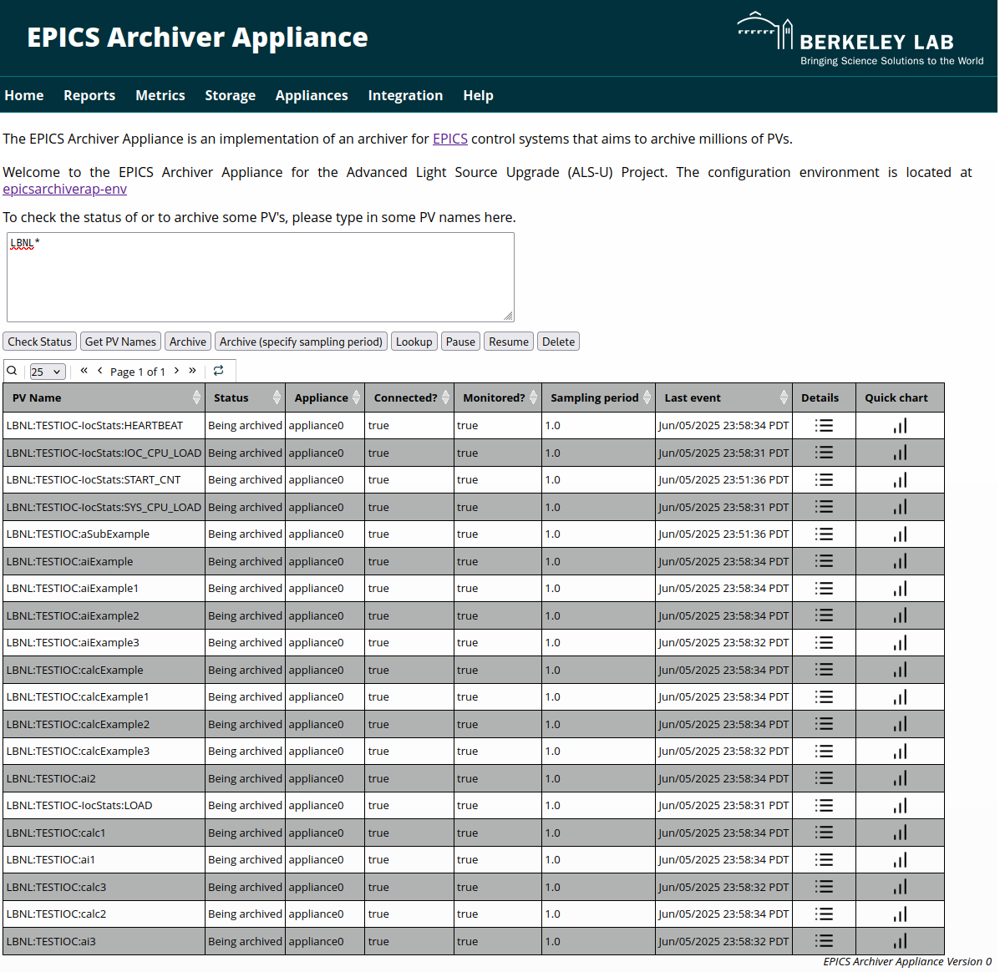

# EPICS Archiver Appliance Configuration Environment with MAVEN
This repository provides the Configuration Environment for the [EPICS Archiver Appliance with MAVEN](https://github.com/jeonghanlee/epicsarchiverap-maven) project, specifically tailored for [the Advanced Light Source Upgrade (ALS-U) Project](https://als.lbl.gov/als-u/overview/) at [Lawrence Berkeley National Laboratory](https://lbl.gov).

The source code for the [EPICS Archiver Appliance with MAVEN](https://github.com/jeonghanlee/epicsarchiverap-maven) build **IS** fundamentally based on the community version. However, its building method **IS NOT** the same as the standard community version. While the goal is to maintain minimal code differences from the community release, some variations may be present. The primary distinction is the use of **MAVEN** as the core build environment for that project, though **ANT** is also currently utilized for certain auxiliary tasks. For a more detailed understanding of the build system and specific modifications in that version, please refer to the [EPICS Archiver Appliance with MAVEN](https://github.com/jeonghanlee/epicsarchiverap-maven) repository.

**Project Status**: Confirmed that the current version can archive a few PV signals. However, it requires more fine-tuning for maximizing the archiver appliance performance.

## Purpose of this Environment
This repository provides a set of `Makefiles` and scripts to automate the setup and build process for the EPICS Archiver Appliance with MAVEN. It handles system dependencies, database configuration, and service management to create a reproducible environment currently on Debian 12.

## Prerequisites
* **JDK 21+**: Java Development Kit version 21 or newer is required.
* **Apache Maven**: A recent version (e.g., 3.9.x).
    * For easy Java/Maven setup, see [jeonghanlee/java-env](https://github.com/jeonghanlee/java-env).
* **Git**: Required for generating release notes from commit history (this is part of the documentation generation process).
* **Operating System**:
    * Core build (JARs/WARs) is generally OS-agnostic.
    * Sphinx documentation (`build_docs.sh`) is primarily for Linux.
* **Sphinx Tools**: If building Sphinx documentation (which is enabled by default), ensure Sphinx, Python, and any necessary themes/extensions are installed and configured.

## Debian 12 Setup Guide
This guide outlines the setup and build process on a Debian 12 system.

### Pre-requirement packages
These commands initialize the environment and install essential software packages required for the Archiver Appliance and its dependencies.

```bash
make init
scripts/required_pkgs.sh
```
### MariaDB
This section covers the setup and configuration of the MariaDB database, which will store the archived data and appliance configuration.

```bash
# Start MariaDB service and check its status
sudo systemctl start mariadb
sudo systemctl status mariadb
```

The following make targets automate common database administration tasks:
```
make db.secure
make db.addAdmin
make db.show
make db.create
make db.show
make sql.fill
make sql.show
```

### Tomcat 9
In this environment, Apache Tomcat 9 is used as a source for essential Java libraries (like the Servlet API) and provides a structured directory layout. It is primarily used as a build-time dependency and is not run as a continuous service for hosting the web applications.

```
# Set or display Tomcat-specific variables used in the build process
make vars FILTER=TOMCAT

# Download the specified version of Tomcat 9
make tomcat.get

# Install Tomcat 9 to the designated location, making its libraries and tools available
make tomcat.install

# Verify that Tomcat has been installed correctly and its components are accessible
make tomcat.exist
```

### Build, install, and Service
With the environment and dependencies in place, these commands compile the Archiver Appliance source code, install it to the target directories, and manage the systemd service.

```
# Compile the EPICS Archiver Appliance source code
make build

# Install the compiled application and necessary files
make install

# Check if the application components exist in their installed locations
make exist

# Start the Archiver Appliance service (likely a systemd service)
make sd_start

# Check the current status of the Archiver Appliance service
make sd_status
```

### Home Screenshot
||
| :---: |
|**Figure 1** Archiver Appliance Home Screen|

### Switch between different source commits
To build against a different version of the source code:

* First, update the `SRC_TAG` variable in the `configure/RELEASE` file to the desired Git commit hash, tag, or branch name.
* Then, run the following command to update the source code checkout:

```bash
make srcupdate
```
